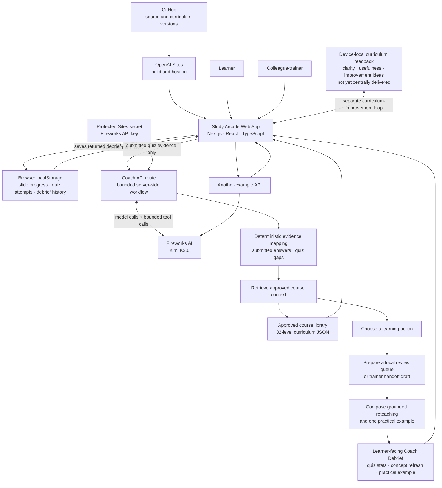

# Study Arcade architecture

This Mermaid diagram shows the current demo architecture, including the boundary between the Fireworks-powered Coach workflow and learning history stored locally in the learner's browser.

The Coach receives recent review context only when the browser submits it with a debrief request. Fireworks does not persist learner history, and the current demo has no central learner database or trainer dashboard.
